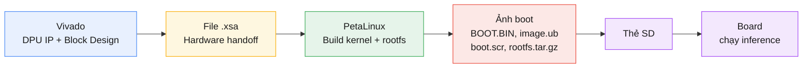
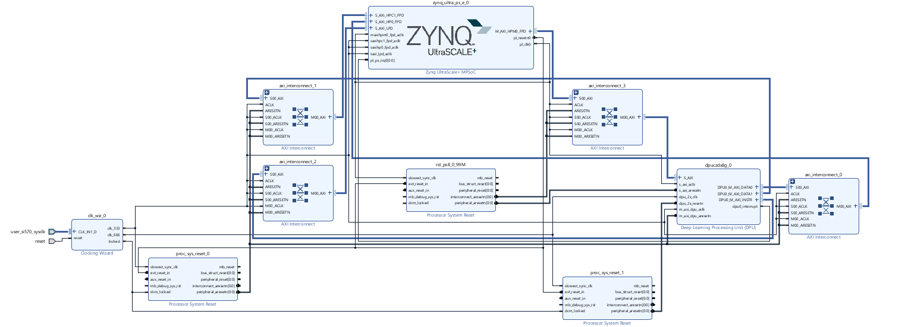

# Hướng dẫn triển khai DPU (Deep Learning Processing Unit) trên Vivado + PetaLinux

Tài liệu này hướng dẫn toàn bộ quy trình tích hợp lõi IP **DPUCZDX8G** (Deep-learning Processing Unit của Xilinx cho dòng MPSoC) vào một thiết kế phần cứng Vivado, sau đó xây dựng hệ điều hành PetaLinux tương ứng, đóng gói ảnh khởi động, chuẩn bị thẻ SD và chạy inference bằng Vitis AI trên board.

## Tổng quan quy trình



---

## 1. Yêu cầu môi trường

| Thành phần | Phiên bản / Ghi chú |
|---|---|
| Vivado | 2022.2 |
| DPU IP | DPUCZDX8G_v4.1.0 (dùng cho dòng MPSoC) |
| PetaLinux | 2022.2 |
| Hệ điều hành host | Ubuntu 20.04 |
| Kiến thức nền | Đã quen thao tác cơ bản trên Vivado (tạo block design, add IP, các lab cơ bản) |

> **Lưu ý:** Vivado, PetaLinux và Vitis phải cùng version (2022.2) để tránh lỗi không tương thích giữa file .xsa và toolchain PetaLinux/Vitis AI.

### Cấu trúc thư mục cài đặt đề xuất

```
Xilinx/
├── Petalinux/               # Bộ cài PetaLinux 2022.2
├── Vivado/                  # Bộ cài Vivado 2022.2
├── Vitis/                   # Bộ cài Vitis (kèm Vitis-AI)
│   └── Vitis-AI/
│       └── Vitis-AI-3.0/
└── projects/
    └── dpu/                 # Project PetaLinux của bạn
```

---

## 2. Tải và cài đặt PetaLinux trên Ubuntu

Trước khi bắt tay vào Vivado, nên cài sẵn PetaLinux vì bước sau (tạo project PetaLinux) cần dùng ngay.

1. Tải bộ cài **PetaLinux 2022.2** (`.run` installer) từ trang Xilinx/AMD Downloads về máy Ubuntu 20.04.
2. Cài các gói phụ thuộc hệ thống theo yêu cầu của PetaLinux (thư viện dựng kernel, `gcc`, `make`, `tar`, `python3`, v.v. — tham khảo *PetaLinux Tools Installation Guide* của Xilinx cho danh sách đầy đủ theo từng bản Ubuntu).
3. Chạy installer với quyền **user thường** (không dùng `root`):
   ```bash
   chmod +x petalinux-v2022.2-*.run
   ./petalinux-v2022.2-*.run -d ~/Xilinx/Petalinux
   ```
4. Sau khi cài xong, nạp biến môi trường mỗi khi mở terminal mới để dùng được các lệnh `petalinux-*`:
   ```bash
   source ~/Xilinx/Petalinux/settings.sh
   ```

---

## 3. Thêm IP DPU vào Vivado

1. Mở Vivado → vào **Tools → Settings → IP → Repository**.
2. Chọn **Add Repository**, trỏ tới thư mục chứa IP DPU (DPUCZDX8G) đã tải và giải nén.
3. Sau khi Vivado quét xong, IP `DPUCZDX8G` sẽ xuất hiện trong catalog và có thể **Add IP** vào block design như các IP thông thường khác.

### Tạo Block Design

- Chọn đúng **board** tương ứng (ZCU102/ZCU104…) khi tạo project để Vivado tự nhận preset cấu hình phần cứng.
- Thêm **Zynq UltraScale+ MPSoC** block, chạy **Run Block Automation** để tự động cấu hình theo board.
- Thêm IP **DPUCZDX8G** vào canvas, kết nối theo hướng dẫn đi kèm IP (AXI interconnect, interrupt, reset...).

### Cấu hình xung Clock (Clocking Wizard)

- Thêm IP **Clocking Wizard**.
- Ở mục cấu hình input clock, chọn tín hiệu **user_si570_sysclk** (được board preset cung cấp) làm nguồn clock đầu vào cho Clocking Wizard.
- Từ Clocking Wizard, tạo ra các xung clock theo yêu cầu của DPU. Ở tài liệu này sử dụng tần số **333 MHz** cho lõi DPU và **100 MHz** để giao tiếp với Zynq MPSoC.



Sau khi hoàn tất kết nối, chạy **Validate Design**, sau đó **Generate Bitstream**, và **File → Export → Export Hardware** (chọn *Include bitstream*) để xuất ra file **.xsa** — đây là đầu vào cho bước PetaLinux.

---

## 4. Tạo project PetaLinux và nạp thông tin phần cứng

Trên terminal Ubuntu:

```bash
source ~/Xilinx/Petalinux/settings.sh
petalinux-create -t project --template zynqMP --name dpu
cd dpu
petalinux-config --get-hw-description=<đường-dẫn-tới-thư-mục-chứa-file-.xsa>
petalinux-config -c rootfs
```

Giải thích:

- `source settings.sh`: nạp biến môi trường để dùng được các lệnh `petalinux-*`.
- `petalinux-create --template zynqMP`: tạo project PetaLinux mới cho dòng Zynq UltraScale+ MPSoC.
- `petalinux-config --get-hw-description`: nạp file `.xsa` xuất từ Vivado vào project, PetaLinux sẽ tự sinh device tree và cấu hình phần cứng tương ứng.
- `petalinux-config -c rootfs`: mở menu cấu hình root filesystem (chọn package, thư viện sẽ đóng gói vào rootfs).

---

## 5. Tích hợp recipe Vitis AI vào PetaLinux

Vitis AI cung cấp sẵn bộ recipe (`vai_petalinux_recipes`) để build các thành phần runtime (VART, XIR, Vitis AI Library…) ngay trong PetaLinux. Copy toàn bộ nội dung của thư mục này vào `project-spec/meta-user/` của project PetaLinux:

```bash
cp -r ~/Xilinx/Vitis/Vitis-AI/Vitis-AI-3.0/src/vai_petalinux_recipes/* \
      /đường/dẫn/tới/dpu/project-spec/meta-user/
```

Sau khi copy, cấu trúc `project-spec/meta-user/` sẽ có thêm hai thư mục mới:

```
project-spec/meta-user/
├── conf/
├── recipes-apps/
├── recipes-bsp/
├── recipes-kernel/
├── recipes-vai-kernel/      ← mới thêm
└── recipes-vitis-ai/        ← mới thêm
```

### Khai báo package mới cho rootfs config

Mở file cấu hình bằng trình soạn thảo (ví dụ `nano` hoặc `vim`):

```bash
nano project-spec/meta-user/conf/user-rootfsconfig
```

Thêm vào cuối file các dòng sau (tương ứng tên các recipe vừa copy):

```
CONFIG_unilog
CONFIG_xir
CONFIG_target-factory
CONFIG_vart
CONFIG_vitis-ai-library
```

Việc khai báo này giúp các package trên xuất hiện như những **tuỳ chọn user package** trong menu cấu hình rootfs, để có thể bật/tắt việc đóng gói chúng vào ảnh Linux cuối cùng.

### Bật các package trong menuconfig

Chạy lại:

```bash
petalinux-config -c rootfs
```

Vào mục **user packages**, tick chọn:

- `target-factory`
- `unilog`
- `vart`
- `vitis-ai-library`
- `xir`

Ngoài ra, vào mục package group liên quan để bật thêm:

- `packagegroup-petalinux-opencv`

**Giải thích chung:** đây là các thư viện runtime cốt lõi của Vitis AI chạy trên board — `unilog` (logging chung), `xir` (biểu diễn đồ thị mô hình AI dưới dạng XIR graph), `target-factory` (nhận diện cấu hình target board/DPU), `vart` (Vitis AI Runtime, chịu trách nhiệm nạp và chạy model .xmodel trên DPU), `vitis-ai-library` (các API mức cao dựng sẵn cho các tác vụ AI phổ biến như detection, classification…). `packagegroup-opencv` cần thiết vì phần lớn ví dụ/ứng dụng Vitis AI dùng OpenCV để xử lý ảnh đầu vào/đầu ra.

### Điều chỉnh recipe VART cho đúng biến thể Vivado

Một số recipe có sẵn 2 biến thể (build cho DPU cấu hình sẵn của Xilinx, và build cho DPU tự tích hợp qua Vivado). Vì DPU ở đây được tự tích hợp trong Vivado, cần dùng biến thể `_vivado`:

```bash
ls project-spec/meta-user/recipes-vitis-ai/vart/
rm project-spec/meta-user/recipes-vitis-ai/vart/vart_3.0.bb
mv project-spec/meta-user/recipes-vitis-ai/vart/vart_3.0_vivado.bb \
   project-spec/meta-user/recipes-vitis-ai/vart/vart_3.0.bb

# Kiểm tra lại nội dung recipe sau khi đổi tên
grep -E "^(SUMMARY|DESCRIPTION|DEPENDS|PACKAGECONFIG|SRC_URI)" \
   project-spec/meta-user/recipes-vitis-ai/vart/vart_3.0.bb
```

Sau đó build riêng package `vart` để kiểm tra recipe chạy đúng trước khi build toàn bộ:

```bash
petalinux-build -c vart
```

---

## 6. Build và đóng gói ảnh boot

Build toàn bộ project:

```bash
petalinux-build
```

Đóng gói các thành phần khởi động thành `BOOT.BIN`:

```bash
petalinux-package --force --boot \
  --fsbl images/linux/zynqmp_fsbl.elf \
  --fpga images/linux/*.bit \
  --u-boot images/linux/u-boot.elf \
  --pmufw images/linux/pmufw.elf \
  --atf images/linux/bl31.elf
```

Trong đó:

- `zynqmp_fsbl.elf`: First Stage Boot Loader, chương trình nhỏ chạy đầu tiên để khởi tạo phần cứng cơ bản.
- `*.bit`: bitstream cấu hình FPGA (chứa cả DPU đã tích hợp).
- `u-boot.elf`: bootloader chính, nạp kernel Linux.
- `pmufw.elf`: firmware cho Platform Management Unit.
- `bl31.elf`: ARM Trusted Firmware (EL3 monitor), phối hợp giữa các mức bảo mật/thực thi của CPU.

---

## 7. Chuẩn bị thẻ SD

Thẻ SD cần chia làm 2 phân vùng:

| Phân vùng | Định dạng | Dung lượng | Nội dung |
|---|---|---|---|
| BOOT | FAT32 | ~2 GB | `BOOT.BIN`, `image.ub` (kernel + device tree + ramdisk), `boot.scr` (script boot) |
| rootfs | EXT4 | Phần còn lại | Toàn bộ root filesystem: `rootfs.tar.gz` chứa `/root`, `/home`, `/usr`, `/lib`, thư mục `application`/model AI sau này... |

Ghi `BOOT.BIN`, `image.ub`, `boot.scr` vào phân vùng BOOT, và giải nén `rootfs.tar.gz` (được PetaLinux sinh ra) vào phân vùng rootfs.

### File cụ thể lấy từ `images/linux/` sau khi build

Sau khi `petalinux-build` xong, thư mục `images/linux/` sẽ chứa rất nhiều file (fsbl, bitstream, u-boot, dtb, rootfs…). Không phải file nào cũng cần chép ra thẻ SD — chỉ cần đúng các file sau:

| Phân vùng | File cần lấy trong `images/linux/` | Ghi chú |
|---|---|---|
| **BOOT** (FAT32) | `BOOT.BIN` | Đã được đóng gói sẵn từ bước `petalinux-package --boot` (gồm FSBL + bitstream + u-boot + pmufw + atf) |
| **BOOT** (FAT32) | `image.ub` | Ảnh FIT chứa kernel Image + device tree (`system.dtb`) + ramdisk (nếu có) |
| **BOOT** (FAT32) | `boot.scr` | Script U-Boot, điều khiển thứ tự boot |
| **rootfs** (EXT4) | `rootfs.tar.gz` **hoặc** `rootfs.ext4` | Chọn 1 trong 2 cách bên dưới |

Có **2 cách** đưa rootfs vào phân vùng EXT4, chọn 1:

1. **Giải nén tarball vào phân vùng đã format sẵn** (linh hoạt, dễ chỉnh sửa thêm file sau này):
   ```bash
   sudo mkfs.ext4 -L rootfs /dev/sdX2
   sudo mount /dev/sdX2 /mnt/rootfs
   sudo tar -xzf rootfs.tar.gz -C /mnt/rootfs
   sudo umount /mnt/rootfs
   ```
2. **Ghi thẳng file ảnh `rootfs.ext4` xuống phân vùng** (nhanh, không cần giải nén thủ công):
   ```bash
   sudo dd if=rootfs.ext4 of=/dev/sdX2 bs=4M status=progress conv=fsync
   ```

Các file còn lại như `bl31.bin/elf`, `pmufw.elf`, `zynqmp_fsbl.elf`, `u-boot.elf`, `u-boot.bin`, `system.bit`, `Image`, `Image.gz`, `vmlinux`, `system.dtb`, `my_rootfs.img`, `enabled-rootfs-packages.txt`, `rootfs.manifest`, `config`, `bootgen.bif`, `pxelinux.cfg`, các file `zynqmp-qemu-*.dtb` … là **file trung gian hoặc phục vụ mục đích khác** (build QEMU, debug, đóng gói lại BOOT.BIN…) — **không cần** chép ra thẻ SD.

---

## 8. Cài đặt Vitis AI runtime, model và chạy inference trên board

1. Tải **Vitis AI** (repo chính thức của Xilinx/AMD) về máy host, ví dụ vào `~/Xilinx/Vitis/Vitis-AI`.
2. Tải model mẫu, ví dụ `pt_yolov5-nano_coco_640_640_4.6G_3.0` (bản `.xmodel` dành cho ZCU102 & ZCU104), bằng công cụ tải model có sẵn trong Vitis AI:

   ```bash
   cd ~/Xilinx/Vitis/Vitis-AI/Vitis-AI-3.0/model_zoo
   python3 downloader.py
   ```

3. Sau khi tải xong, copy model vào thư mục `/home/root/models` trên phân vùng rootfs của thẻ SD (hoặc copy trực tiếp vào board qua `scp` sau khi board đã boot lên và có mạng).

Sau bước này, board đã sẵn sàng: boot bằng thẻ SD → DPU trong FPGA được cấu hình sẵn qua bitstream → VART/Vitis AI Library trên Linux nạp model `.xmodel` từ `/home/root/models`.

### Chạy thử inference

4. Chuẩn bị một ảnh test bất kỳ, đặt tên `test.png`, rồi copy vào thư mục `/home/root/` trên board — có thể copy trực tiếp vào phân vùng rootfs của thẻ SD trước khi boot, hoặc dùng `scp` sau khi board đã lên mạng:

   ```bash
   scp test.png root@<ip-của-board>:/home/root/
   ```

5. Trên board, chạy script inference (đã chuẩn bị sẵn tại `/home/root/yolo_detector.py`, sử dụng VART để nạp model `.xmodel` và chạy trên DPU):

   ```bash
   python3 /home/root/yolo_detector.py
   ```

   Script sẽ đọc `/home/root/test.png` làm ảnh đầu vào, chạy inference qua DPU thông qua Vitis AI Runtime (VART), và xuất kết quả detection (ví dụ ảnh có vẽ bounding box, hoặc log toạ độ/độ tin cậy các đối tượng nhận diện được, tuỳ theo cách script được viết).

---

## Tóm tắt luồng công việc

1. Tải và cài đặt PetaLinux trên Ubuntu.
2. Tích hợp IP DPU vào Vivado, cấu hình clock, xuất `.xsa`.
3. Tạo project PetaLinux, nạp `.xsa`.
4. Copy và cấu hình recipe Vitis AI (`vart`, `xir`, `unilog`, `target-factory`, `vitis-ai-library`) vào rootfs.
5. Build project, đóng gói `BOOT.BIN`.
6. Chia thẻ SD 2 phân vùng (BOOT – FAT32, rootfs – EXT4), ghi ảnh vào thẻ.
7. Tải Vitis AI + model `.xmodel`, đưa vào `/home/root/models` trên board.
8. Copy ảnh `test.png` vào `/home/root/`, chạy `python3 /home/root/yolo_detector.py` để chạy inference.
